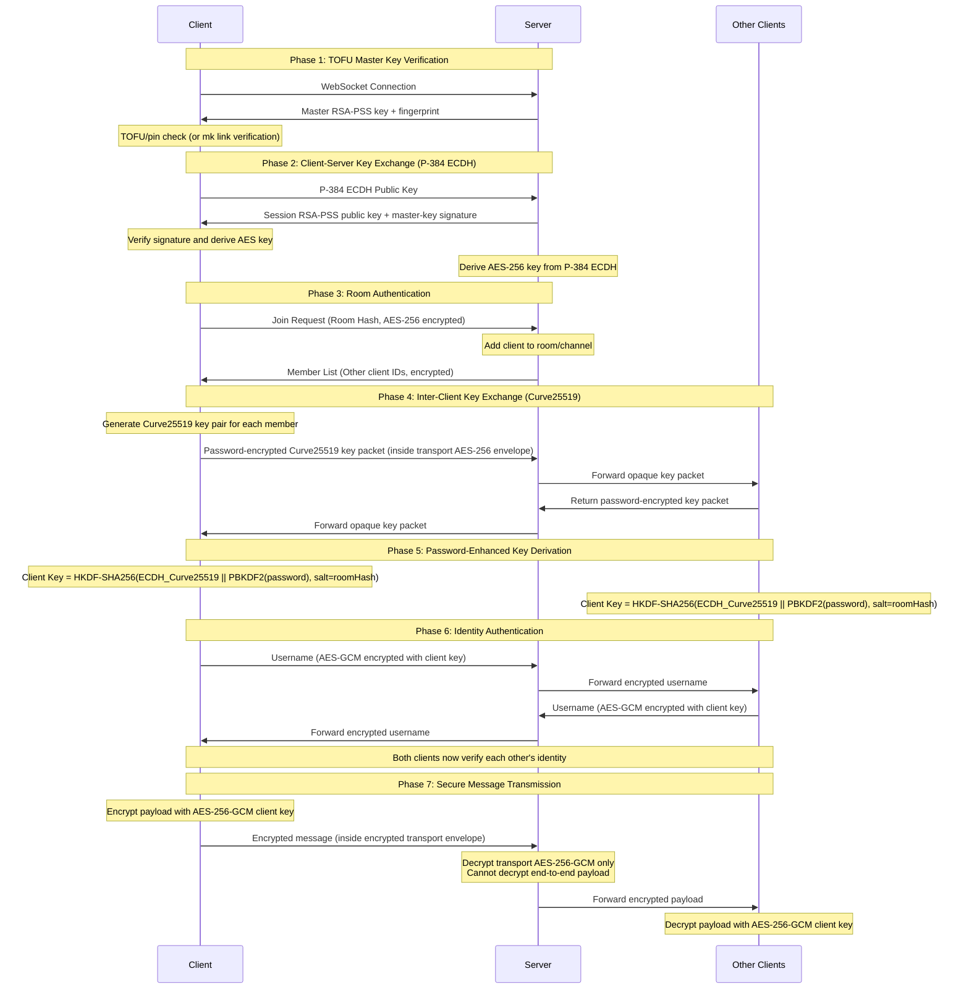

# NodeCrypt

🌐 **[中文版 README](README_ZH.md)**

## 🚀 Deployment Instructions

### Method 1: One-Click Deploy to Cloudflare Workers

Click the button below for one-click deployment to Cloudflare Workers:

> Note: This method creates a new project based on the main repository. Future updates to the main repository will not be automatically synchronized.

### Method 2: Auto-Sync Fork and Deploy (Recommended for Long-term Maintenance)
1. First, fork this project to your own GitHub account.
2. Open the Cloudflare Workers console, select "Import from GitHub," and choose your forked repository for deployment.
> This project has built-in auto-sync workflow. After forking, no action is required. Updates from the main repository will automatically sync to your fork, and Cloudflare will automatically redeploy without manual maintenance.

### Method 3: Local Development Deployment
After cloning the project and installing dependencies, use `npm run dev` to start the development server.
Use `npm run deploy` to deploy to Cloudflare Workers.

## 📝 Project Introduction

NodeCrypt is a truly end-to-end encrypted chat system that implements a complete zero-knowledge architecture. The entire system design ensures that servers, network intermediaries, and even system administrators cannot access any plaintext message content. All encryption and decryption operations are performed locally on the client side, with the server serving only as a blind relay for encrypted data.

### System Architecture
- **Frontend**: ES6+ modular JavaScript, no framework dependencies
- **Backend**: Cloudflare Workers + Durable Objects + KV
- **Communication**: Real-time bidirectional WebSocket communication
- **Build**: Vite modern build tool

## 🔐 Zero-Knowledge Architecture Design

### Core Principles
- **Server Blind Relay**: The server can never decrypt message content, only responsible for encrypted data relay
- **No Chat History Storage**: The system does not persist chat plaintext/history; message data exists only in runtime memory
- **End-to-End Encryption**: Messages are encrypted from sender to receiver throughout the entire process; no intermediate node can decrypt them
- **Forward Secrecy**: Even if keys are compromised, historical messages cannot be decrypted because there are no historical messages at all
- **Anonymous Communication**: Users do not need to register real identities; supports temporary anonymous chat
- **Rich Experience**: Support for sending images/files, private chat by clicking user avatar, selectable UI themes and languages

### Privacy Protection Mechanisms

- **Real-time Member Notifications**: The room online list is completely transparent; any member joining or leaving will notify all members in real-time
- **No Historical Messages**: Newly joined users cannot see any historical chat records
- **Private Chat Encryption**: Clicking on a user's avatar can initiate end-to-end encrypted private conversations that are completely invisible to other room members

### Room Password Mechanism

Room passwords serve as **key derivation factors** in end-to-end encryption: `Final Shared Key = HKDF-SHA256(ECDH_Shared_Key || PBKDF2(Room Password))`

- **Password Error Isolation**: Rooms with different passwords cannot decrypt each other's messages
- **Server Blind Spot**: The server can never know the room password

### Three-Layer Security System

#### Layer 1: TOFU + Master-Key-Based Server Identity Authentication
- Server maintains a long-term RSA-2048 **master key** (KV storage)
- On connect, client receives server master key fingerprint, applies TOFU (Trust On First Use), and pins it per domain in browser localStorage
- Session RSA-PSS public key must be signed by the trusted master key, otherwise connection is blocked
- Optional `mk` URL parameter allows out-of-band fingerprint verification in shared invite links

#### Layer 2: ECDH-P384 Key Agreement
- Each client generates independent elliptic curve key pairs (P-384 curve)
- Establishes shared keys through Elliptic Curve Diffie-Hellman key exchange protocol
- Each client has an independent encrypted channel with the server

#### Layer 3: Symmetric Encryption (AES-GCM)
- **Server Communication**: Uses AES-GCM with per-message nonce/IV and additional authenticated data (AAD)
- **Client Communication**: Uses AES-GCM with separate AAD context for client payloads
- Provides confidentiality + integrity for transport/application payloads

## 🔄 Complete Encryption Process

## 🛠️ Technical Implementation

- **Web Cryptography API**: Native browser encryption implementation with hardware acceleration
- **@noble/curves (x25519)**: Modern audited Curve25519 implementation for inter-client ECDH
- **Web Crypto AES-GCM/HKDF/PBKDF2/RSA-PSS**: Standard primitives provided by browser and Worker runtimes

## 🔬 Security Verification

### Encryption Process Verification
Users can observe the complete encryption and decryption process through browser developer tools to verify that messages are indeed encrypted during transmission.

### Network Traffic Analysis
Network packet capture tools can verify that all WebSocket transmitted data is unreadable encrypted content.

### Code Security Audit
All encryption-related code is completely open source, using standard cryptographic algorithms. Security researchers are welcome to conduct independent audits.

## ⚠️ Security Recommendations

- **Use Strong Room Passwords**: Room passwords directly affect end-to-end encryption strength; complex passwords are recommended
- **Password Confidentiality**: If a room password is leaked, all communication content in that room may be decrypted
- **Use Latest Modern Browsers**: Ensure security and performance of cryptographic APIs

## 🧭 Trust Model & Risk Scenarios

### If you use a trusted NodeCrypt server over `wss://`
- Under this model, the channel is considered secure for normal operation.

### If you use an untrusted NodeCrypt server (not recommended), key risks are:
1. **Client deployed from untrusted server**  
   If you load the web client hosted by the untrusted server, it can poison client files.
3. **Metadata exposure (always true for server operator)**  
   The server can always observe your IP and the IPs of peers you communicate with.

### Media preview risks:
If you haven't disabled media preview in settings, YouTube might know about YouTube videos in chat.

## 🤝 Security Contributions

Security researchers are welcome to report vulnerabilities and conduct security audits. Critical security issues will be fixed within 24 hours.

## 📄 Open Source License

This project uses the ISC open source license.

## ⚠️ Disclaimer

This project is for educational and technical research purposes only and must not be used for any illegal or criminal activities. Users should comply with the relevant laws and regulations of their country and region. The project author assumes no legal responsibility for any consequences arising from the use of this software. Please use this project legally and compliantly.

---

**NodeCrypt** - True End-to-End Encrypted Communication 🔐

*"In the digital age, encryption is the last line of defense for privacy"*